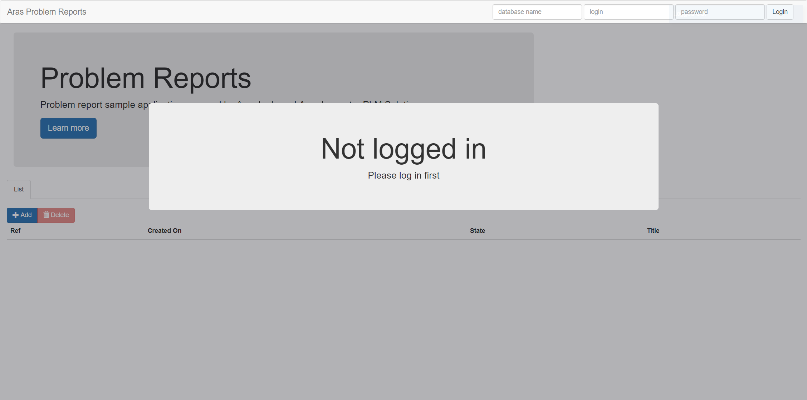
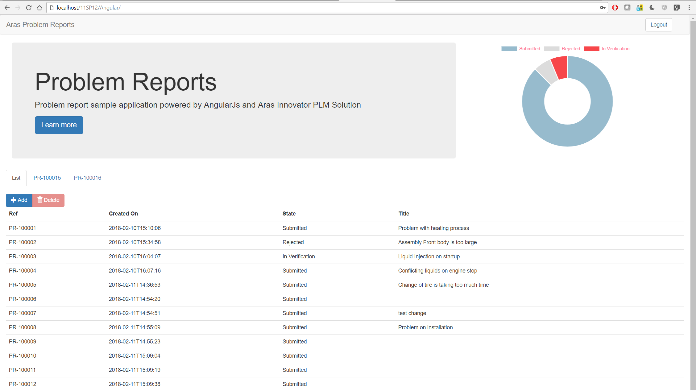
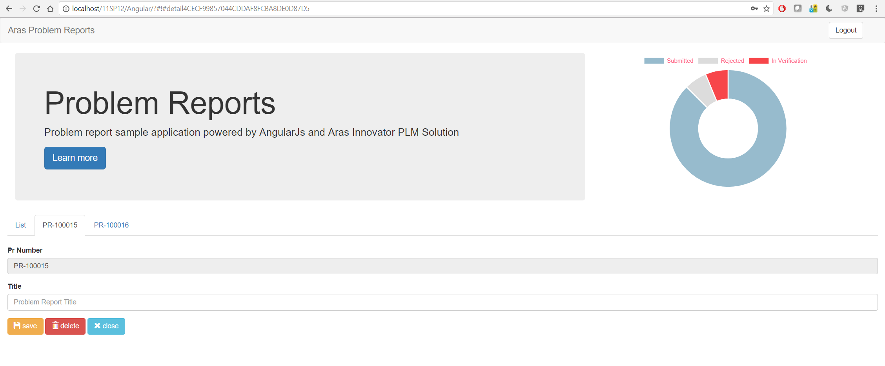

# Sample-AngularJs-PR-management
This is a sample AngularJs client application to demonstrate the use of the REST/oData web service interface introduced in Aras Innovator 11 SP12
#### How it works
AngularJS is a JavaScript-based open-source front-end web application framework mainly maintained by Google and by a community of individuals and corporations to address many of the challenges encountered in developing single-page applications. Aras Innovator 11 SP12 introduced a REST/oData web service interface which is a great fit with all the moderns javascript-based front-end web application frameworks.

## Project Details

**Built Using:** Aras 11.0 SP12

**Browsers Tested:** Chrome

> Though built and tested using Aras 11.0 SP12, this project should function coming releases

## Installation

#### Important!

### Pre-requisites

1. Aras Innovator installed (version 11.0 SP12 or higher)

### Install Steps

1. Open IIS 
2. look for your main Aras Innovator web application 
3. add a new web application (it should come in addition to client / NotificationServer / Server / Vault / ...)
4. Give your application an Alias
5. Select the folder you checked-out this repository as the physical path
6. Save your new web application

## Usage

1. Go to your new application http://(ServerName)/(ArasAppName)/(TheAliasYouSelected) (ex: http://localhost/11SP12/Angular)
2. At the top type the database name, the login and the password

## dependencies

- angularJS
- Bootstrap
- Angular-ui-notification
- Jquery
- lodash
- md5.js
- angular-chart
- chart.js

## Contributing

1. Fork it!
2. Create your feature branch: `git checkout -b my-new-feature`
3. Commit your changes: `git commit -am 'Add some feature'`
4. Push to the branch: `git push origin my-new-feature`
5. Submit a pull request

For more information on contributing to this project, another Aras Labs project, or any Aras Community project, shoot us an email at araslabs@aras.com.

## Credits

Original Aras community project written by Yoann Maingon at Aras Corp.

Documented and published by Yoann Maingon at Aras Labs. @YoannArasLab

## License

Aras Labs projects are published to Github under the MIT license. See the [LICENSE file](./LICENSE.md) for license rights and limitations.